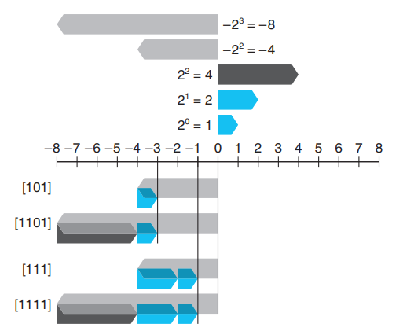

# 1.1 Information Is Bits + Context

Our hello program begins life as a source program (or source file) that the programmer creates with an editor and saves in a text file called hello.c. The source program is a sequence of bits, each with a value of 0 or 1, organized in 8-bit chunks called bytes. Each byte represents some text character in the program.

Most computer systems represent text characters using the **ASCII** standard that represents each character with a unique byte-size integer value. For example, Figure 1.2 shows the ASCII representation of the hello.c program.

The hello.c program is stored in a file as a sequence of bytes. Each byte has an integer value that corresponds to some character. For example, the first byte has the integer value 35, which corresponds to the character ‘#’. The second byte has the integer value 105, which corresponds to the character ‘i’, and so on. Notice that each text line is terminated by the invisible newline character ‘\n’, which is represented by the integer value 10. Files such as hello.c that consist exclusively of ASCII characters are known as **text files**. All other files are known as **binary files**.

The representation of hello.c illustrates a fundamental idea: All information in a system—including disk files, programs stored in memory, user data stored in memory, and data transferred across a network—is represented as a bunch of bits. The only thing that distinguishes different data objects is the context in which we view them. For example, in different contexts, the same sequence of bytes might represent an integer, floating-point number, character string, or machine instruction.

As programmers, we need to understand machine representations of numbers because they are not the same as integers and real numbers. They are finite approximations that can behave in unexpected ways. This fundamental idea is explored in detail in Chapter 2.


#### Aside --- Origins of the C programming language

C was developed from 1969 to 1973 by Dennis Ritchie of Bell Laboratories. The American National Standards Institute (ANSI) ratified the ANSI C standard in 1989, and this standardization later became the responsibility of the International Standards Organization (ISO). The standards define the C language and a set of library functions known as the C standard library. Kernighan and Ritchie describe ANSI C in their classic book, which is known affectionately as “K\&R” \[61]. In Ritchie’s words \[92], C is “quirky, flawed, and an enormous success.” So why the success?

* **C was closely tied with the Unix operating system**. C was developed from the beginning as the system programming language for Unix. Most of the Unix kernel (the core part of the operating system), and all of its supporting tools and libraries, were written in C. As Unix became popular in universities in the late 1970s and early 1980s, many people were exposed to C and found that they liked it. Since Unix was written almost entirely in C, it could be easily ported to new machines, which created an even wider audience for both C and Unix.
* **C is a small, simple language**.The design was controlled by a single person, rather than a committee, and the result was a clean, consistent design with little baggage. The K\&R book describes the complete language and standard library, with numerous examples and exercises, in only 261 pages. The simplicity of C made it relatively easy to learn and to port to different computers.
* **C was designed for a practical purpose**. C was designed to implement the Unix operating system. Later, other people found that they could write the programs they wanted, without the language getting in the way.

C is the language of choice for system-level programming, and there is a huge installed base of application-level programs as well. However, it is not perfect for all programmers and all situations. C pointers are a common source of confusion and programming errors. C also lacks explicit support for useful abstractions such as classes, objects, and exceptions. Newer languages such as C++ and Java address these issues for application-level programs.

