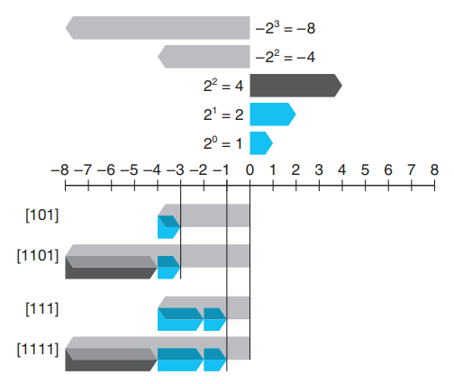

# 2.1 信息存储

大多数计算机使用 8 位的块，或者**字节**（byte），作为最小的可寻址的内存单位，而不是访问内存中单独的位。机器级程序将内存视为一个非常大的字节数组，称为**虚拟内存**（virtual memory）。内存的每个字节都由一个唯一的数字来标识，称为它的**地址**（address），所有可能地址的集合就称为**虚拟地址空间**（virtual address space）。顾名思义，这个虚拟地址空间只是一个展现给机器级程序的概念性映像。实际的实现（见第 9 章）是将动态随机访问存储器（DRAM）、闪存、磁盘存储器、特殊硬件和操作系统软件结合起来，为程序提供一个看上去统一的字节数组。

在接下来的几章中，我们将讲述编译器和运行时系统是如何将存储器空间划分为更可管理的单元，来存放不同的程序对象（program object），即程序数据、指令和控制信息。可以用各种机制来分配和管理程序不同部分的存储。这种管理完全是在虚拟地址空间里完成的。例如，C 语言中一个指针的值（无论它指向一个整数、一个结构或是某个其他程序对象）都是某个存储块的第一个字节的虚拟地址。C 编译器还把每个指针和类型信息联系起来，这样就可以根据指针值的类型，生成不同的机器级代码来访问存储在指针所指向位置处的值。尽管 C 编译器维护着这个类型信息，但是它生成的实际机器级程序并不包含关于数据类型的信息。每个程序对象可以简单地视为一个字节块，而程序本身就是一个字节序列。


#### 给 C 语言初学者 - C 语言中指针的作用

指针是 C 语言的一个重要特性。它提供了引用数据结构（包括数组）的元素的机制。与变量类似，指针也有两个方面：值和类型。它的值表示某个对象的位置，而它的类型表示那个位置上所存储对象的类型（比如整数或者浮点数）。

真正理解指针需要查看它们在机器级上的表示以及实现。这将是第 3 章的重点之 一，3.10.1 节将对其进行深入介绍。


## 2.1.1 十六进制表示法

一个字节由8位组成。在二进制表示法中，它的值域是 $$00000000_2$$\~$$11111111_2$$。如果看成十进制整数，它的值域就是$$0_{10}$$\~$$255_{10}$$。两种符号表示法对于描述位模式来说都不是非常方便。二进制表示法太冗长，而十进制表示法与位模式的互相转化很麻烦。替代的方法是，以 16 为基数，或者叫做_十六进制（hexadecimal）数_，来表示位模式。十六进制（简写为 "hex"） 使用数字 '0' \~ '9' 以及字符 'A' \~ 'F' 来表示 16 个可能的值。图 2-2 展示了 16 个十六进制数字对应的十进制值和二进制值。用十六进制书写，一个字节的值域为$$00_{16}$$\~$$FF_{16}$$。

.png>)

在 C 语言中，以 0x 或 0X 开头的数字常量被认为是十六进制的值。字符 ‘A' \~ ‘F’ 既可以是大写，也可以是小写。例如，我们可以将数字 FA1D37B16 写作 0xFA1D37B，或者 0xfald37b，甚至是大小写混合，比如，0XFa1D37b。在本书中，我们将使用 C 表示法来表示十六进制值。&#x20;

编写机器级程序的一个常见任务就是在位模式的十进制、二进制和十六进制表示之间人工转换。二进制和十六进制之间的转换比较简单直接，因为可以一次执行一个十六进制数字的转换。数字的转换可以参考如图 2-2 所示的表。<mark style="color:green;">一个简单的窍门是，记住十六进制数字 A、C 和 F 相应的十进制值。而对于把十六进制值 B、D 和 E 转换成十进制值，则可以通过计算它们与前三个值的相对关系来完成。</mark>

比如，假设给你一个数字 0x173A4C。可以通过展开每个十六进制数字，将它转换为二进制格式，如下所示：

这样就得到了二进制表示 000101110011101001001100。&#x20;

反过来，如果给定一个二进制数字1111001010110110110011，可以通过首先把它分为每 4 位一组来转换为十六进制。不过要注意，如果位总数不是 4 的倍数，最左边的一组可以少于 4 位，前面用 0 补足。然后将每个 4 位组转换为相应的十六进制数字：

.png>)

当值 x 是 2 的非负整数 n 次幂时，也就是 $$x=2^n$$，我们可以很容易地将 x 写成十六进制形式，只要记住x 的二进制表示就是 1 后面跟 n 个 0。十六进制数字 0 代表 4 个二进制 0。所以，当 n 表示成 i+4j 的形式，其中 0≤i≤3，我们可以把 x 写成开头的十六进制数字为 1(i=0)、2(i=1)、4(i=2) 或者8(i=3)，后面跟随着 i 个十六进制的 0。比如, $$x=2048=2^{11}$$，我们有 n=11=3+4×2，从而得到十六进制表示 0x800。



Perform the following number conversions:&#x20;

A. 0x25B9D2 to binary&#x20;

B. binary 1010111001001001 to hexadecimal&#x20;

C. 0xA8B3D to binary&#x20;

D. binary 1100100010110110010110 to hexadecimal



Fill in the blank entries in the following table, giving the decimal and hexadecimal representations of different powers of 2:

|  n  | 2^n (十进制) | 2^n (十六进制) |
| :-: | :-------: | :--------: |
|  9  |    512    |    0x200   |
|  19 |           |            |
|     |   16384   |            |
|     |           |   0x10000  |
|  17 |           |            |
|     |     32    |            |
|     |           |    0x80    |





A. 0010 1001 1011 1001 1101 0010

B. AE69

C. 1010 1000 1011 0011 1101

D. 322D96



|  n  | 2^n (十进制) | 2^n (十六进制) |
| :-: | :-------: | :--------: |
|  9  |    512    |    0x200   |
|  19 |   524288  |   0x80000  |
|  14 |   16384   |   0x4000   |
|  16 |   65536   |   0x10000  |
|  17 |   131072  |   0x20000  |
|  5  |     32    |    0x20    |
|  7  |    128    |    0x80    |



十进制和十六进制表示之间的转换需要使用乘法或者除法来处理一般情况。将一个十进制数字 x 转换为十六进制，可以反复地用 16 除 x，得到一个商 q 和一个余数 r，也就是 x=q·16+r。然后，我们用十六进制数字表示的 r 作为最低位数字，并且通过对 q 反复进行这个过程得到剩下的数字。例如，考虑十进制 314156的转换：

.png>)

从这里，我们能读出十六进制表示为 0x4CB2C。&#x20;

反过来，将一个十六进制数字转换为十进制数字，我们可以用相应的 16 的幂乘以每个十六进制数字。比如，给定数字 0x7AF，我们计算它对应的十进制值为 7·16^2+10· 16+15=7·256+10·16+15=1792+160+15=1967。



A single byte can be represented by 2 hexadecimal digits. \
Fill in the missing entries in the following table, giving the decimal, binary, and hexadecimal values of different byte patterns:

| 十进制 |    二进制    | 十六进制 |
| :-: | :-------: | :--: |
|  0  | 0000 0000 | 0x00 |
| 167 |           |      |
|  62 |           |      |
| 188 |           |      |
|     | 0011 0111 |      |
|     | 1000 1000 |      |
|     | 1111 0011 |      |
|     |           | 0x52 |
|     |           | 0xAC |
|     |           | 0xE7 |



Without converting the numbers to decimal or binary, try to solve the following arithmetic problems, giving the answers in hexadecimal. \
_Hint: Just modify the methods you use for performing decimal addition and subtraction to use base 16._

A. 0x605c + 0x5 =&#x20;

B. 0x605c − 0x20 =&#x20;

C. 0x605c + 32 =&#x20;

D. 0x60fa − 0x605c =





| 十进制 |    二进制    | 十六进制 |
| :-: | :-------: | :--: |
|  0  | 0000 0000 | 0x00 |
| 167 | 1010 0111 | 0xA7 |
|  62 | 0011 1110 | 0x3E |
| 188 | 1011 1100 | 0xBC |
|  55 | 0011 0111 | 0x37 |
| 136 | 1000 1000 | 0x88 |
| 243 | 1111 0011 | 0xF3 |
|  82 | 0101 0010 | 0x52 |
| 172 | 1010 1100 | 0xAC |
| 231 | 1110 0111 | 0xE7 |



A. 0x605c + 0x5 = 0x6061

B. 0x605c − 0x20 = 0x603c

C. 0x605c + 32 = 0x607c

D. 0x60fa − 0x605c =0x9e




#### 十进制和十六进制间的转换&#x20;

较大数值的十进制和十六进制之间的转换，最好是让计算机或者计算器来完成。有大量的工具可以完成这个工作。\
一个简单的方法就是利用任何标准的搜索引擎，比如查询：&#x20;

Convert 0xabcd to decimal

or

123 in hex


## 2.1.2 字数据大小

## 2.1.3 寻址和字节顺序

大端法

| \*\*\*\* | 0x100 | 0x101 | 0x102 | 0x103 |     |
| -------- | :---: | :---: | :---: | :---: | :-: |
| ⋯        |   01  |   23  |   45  |   67  |  ⋯  |

小端法

| \*\*\*\* | 0x100 | 0x101 | 0x102 | 0x103 |     |
| -------- | :---: | :---: | :---: | :---: | :-: |
| ⋯        |   67  |   45  |   23  |   01  |  ⋯  |

## 2.1.4 表示字符串

## 2.1.5 表示代码

## 2.1.6 布尔代数简介

## 2.1.7 C 语言中的位级运算

## 2.1.8 C 语言中的逻辑运算

## 2.1.9 C 语言中的移位运算
